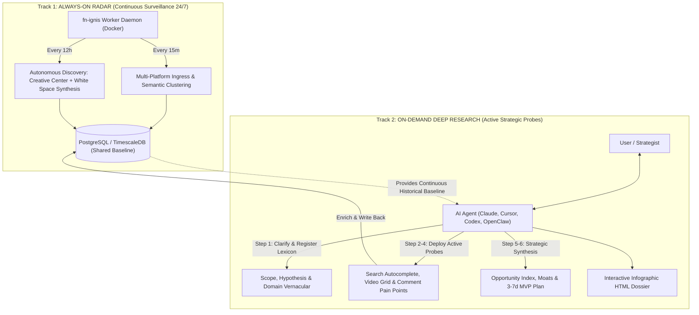

# fnIgnis 🔥 *(Code Name: fn-ignis)*

[](https://finolabs.io)
[](https://github.com/fioenix/fn-ignis/actions)
[](https://opensource.org/licenses/MIT)
[](https://www.python.org/downloads/)
[](https://modelcontextprotocol.io/)
[](https://www.docker.com/)

> **fnIgnis — Unified Self-Hosted Autonomous Trend Intelligence & Market Opportunity Platform by FINOLABS**

`fnIgnis` (`fn-ignis`) is a high-performance, self-hosted market listening and strategic research engine developed by **FINOLABS**. It empowers AI Agents (**Claude Desktop, Claude Code, Cursor, Windsurf, Antigravity, OpenAI Codex, OpenClaw, and Nous Hermes**) and human strategists to discover high-value market white spaces across Google Trends, YouTube, TikTok Creative Center, TikTok Search Suggestions, and raw Voice-of-Customer comments with **$0 token ingress costs**, deterministic mathematical scoring (**Opportunity Index**), autonomous lexicon expansion, and pixel-perfect interactive HTML Dashboard artifacts.


---

## 🌟 Key Highlights

- **⚡ Zero-Token Local Ingress**: Collects, filters, and normalizes high-volume signals locally using deterministic Python parsers without burning expensive LLM API tokens on raw scraping.
- **🏛️ Dual-Track Architecture**: Combines a continuous 24/7 background radar daemon (`fn-ignis-worker`) with interactive, hypothesis-driven strategic deep dives on-demand.
- **📊 Mathematical Opportunity Index**: Quantifies market white spaces (+100 to -100) by mathematically comparing macro search demand velocity against localized content supply volume.
- **🗣️ Voice of Customer Ingress**: Scrapes and synthesizes real customer pain points, pricing inquiries, and unmet objections directly from public video comment sections.
- **🧠 Autonomous Dynamic Lexicon Engine**: Persistent PostgreSQL registry allowing agents to dynamically register niche slang, brand names, and vernacular on-the-fly without modifying source code.
- **🤖 Universal Agent Ecosystem**: Native out-of-the-box support for Claude, Cursor, Windsurf, Antigravity, Codex, OpenClaw, and Hermes.

---

## 🏛️ Architecture: The Dual-Track Model



---

## 🧭 6-Step Standard Operating Procedure (SOP)

Every targeted research mission follows a deterministic 6-step workflow:

```
Step 1: Clarify Research Objectives & Core Hypothesis
   ↓ (Autonomous Lexicon Registration: Register vertical slang in DB)
Step 2: Macro Scan & Real-World Keyword Expansion (Creative Center & Autocomplete Suggestions)
   ↓ (Feedback Loop: Expand scope with authentic user slang and sub-niches)
Step 3: Deep Multi-Platform Ingress & Quality Gate (Spam rejection, Confidence >= 70%)
   ↓
Step 4: Single-Source 4-Lens Breakdown (Demand, Supply, Intent, Voice of Customer)
   ↓
Step 5: Cross-Source Synthesis & Opportunity Index Matrix (Identify White Spaces)
   ↓
Step 6: Strategic Verdict, Entry Risks & Fast MVP Validation (3-7 day test plan + HTML Dashboard)
```

---

## 🤖 Universal Multi-Agent Compatibility

`fn-ignis` is built from the ground up to integrate seamlessly with any modern AI agent orchestrator:

| AI Agent / Client | Configuration & Standards | Capabilities Supported |
|---|---|---|
| **Claude Desktop** | [`bundle/claude_desktop_config.json`](bundle/claude_desktop_config.json) | 28 FastMCP Tools & Handlers, Prompts, Resources, Automatic SOP Injection |
| **Claude Code** | [`.agents/skills/fn-ignis-harness/SKILL.md`](.agents/skills/fn-ignis-harness/SKILL.md) | Agent Skills Standard, Native In-Chat Artifacts |
| **Cursor IDE** | [`.cursor/rules/fn-ignis.mdc`](.cursor/rules/fn-ignis.mdc), [`.cursorrules`](.cursorrules) | Context-Aware Multi-Platform Market Intelligence |
| **Windsurf IDE** | [`.windsurfrules`](.windsurfrules) | Cascade Step-by-Step Research Rule Protocol |
| **Antigravity / Gemini Code** | [`AGENTS.md`](AGENTS.md) + Agent Skills | Dual-Track Continuous Radar & Dynamic Lexicon Ingress |
| **OpenAI Codex** | [`.codex/instructions.md`](.codex/instructions.md), [`.codexrules`](.codexrules) | Thread Session Continuity (`codex://threads/...`), Structured Tools |
| **OpenClaw** | [`openclaw.json`](openclaw.json), [`.openclaw/config.yaml`](.openclaw/config.yaml) | OpenClaw Plugin v1 Schema with Lifecycle Hooks |
| **Nous Hermes** | [`.hermes/tools.json`](.hermes/tools.json), [`hermes_manifest.json`](hermes_manifest.json) | Native Structured Function-Calling JSON Schema |

<!-- mcp-name: io.github.fioenix/fn-ignis -->

---

## 🛠️ FastMCP Tool & Resource Catalog

### 1. Market Research & Strategic Synthesis
- **`run_autonomous_research_mission(topic, keywords, geo, timeframe, min_signals)`**: End-to-end mission creation, multi-platform refinement loop, and white space synthesis.
- **`create_research_mission(title, keywords, geo, timeframe, hypothesis)`**: Initialize a new targeted research campaign.
- **`execute_mission_ingress(mission_id)`**: Execute deep multi-platform data collection with automated quality gate evaluation.
- **`evaluate_mission_quality(mission_id)`**: Re-evaluate multi-dimensional quality scorecard.
- **`discover_market_opportunities(mission_id)`**: Discover unserved content and product white spaces.
- **`get_mission_analysis(mission_id)`**: Retrieve full synthesized strategic analysis (Opportunity Index, white spaces, action plan).
- **`generate_mission_artifact(mission_id)`**: Export a standalone, high-contrast interactive Infographic HTML Dashboard to `reports/`.
- **`list_research_missions(limit)`**: List all historical research campaigns.
- **`get_current_session_mission(session_id)`**: Restore active mission linked to current chat thread.
- **`trigger_autonomous_discovery(geo)`**: Trigger an on-demand full autonomous discovery cycle.
- **`get_latest_daily_discovery(geo)`**: Retrieve the latest automated daily discovery digest.

### 2. Social Listening & Voice of Customer
- **`get_tiktok_creative_center_trends(geo, period, limit, industry)`**: Fetch official nationwide industry ranking benchmarks with optional vertical filtering.
- **`get_tiktok_search_suggestions(keywords, geo)`**: Fetch live autocomplete search suggestions and trending hashtags.
- **`get_tiktok_video_comments(video_url, limit)`**: Scrape raw public comments for a specific video.
- **`extract_customer_pain_points(keywords, geo, max_videos, inquiry_patterns)`**: Extract customer objections, pricing inquiries, and unmet needs from comments.

### 3. Dynamic Lexicon & Infrastructure Diagnostics
- **`register_domain_lexicon(domain, terms, category)`**: Dynamically register new niche vocabulary/slang into database.
- **`register_noise_blacklist(terms)`**: Register unwanted viral spam words into the blacklist.
- **`list_domain_lexicons(domain)`**: Query active domain vocabularies and industry mappings.
- **`diagnose_system_health()`**: Query full platform telemetry, circuit breakers, and component status.
- **`get_system_logs(limit, level)`**: Inspect audit event trails.
- **`verify_connectors_health()`**: Run real-time synthetic diagnostics on YouTube quota, Google RSS, TikTok Playwright contexts, database pool, and proxy connectivity.
- **`authenticate_tiktok()`**, **`get_platform_auth_status()`**, **`clear_platform_auth()`**: Managed browser credential lifecycle.
- **`get_trending_topics(geo, timeframe, limit)`**, **`get_topic_detail(topic_id)`**, **`generate_trend_artifact(topic_id, geo)`**, **`trigger_ingress_refresh(geo)`**: Real-time trend exploration.

### 4. FastMCP Native Resources & Prompts
- **Resources**: `fn-ignis://sop/market-research`, `fn-ignis://methodology/opportunity-index`
- **Prompts**: `market_research_pipeline`, `voice_of_customer_audit`

> [!NOTE]
> **Localization Transparency:** Currently, Vietnamese (`VN`) features deep multi-layered linguistic heuristics. Other geographic regions apply universal noise filtering, and their `language_precision` indicates that no negative noise constraints failed rather than natural language parsing (full pluggable `ILanguageDetector` architecture is scheduled for `v0.2.0`).


---

## 📊 Live Reference Case Studies

Explore sample interactive Infographic HTML reports generated directly by `fn-ignis` in the [`reports/`](reports/) directory:

| Campaign / Dossier | Scope & Focus | Highlights & White Spaces Discovered | Live Artifact |
|---|---|---|:---:|
| **`[VN-AI-AGENT-90D]`** | AI Agents & CSKH Automation in Vietnam | High demand for customer service bots; massive white space in enterprise custom integration vs saturated shallow tutorial content. | [View HTML Dossier](reports/case_study_ai_agents_vn.html) |
| **`[VN-LINEN-FASHION-30D]`** | Apparel, Linen & Local Brands | Skyrocketing seasonal search intent for minimal office linen apparel; major supply gaps in oversized tailored linen shirts. | [View HTML Dossier](reports/case_study_linen_fashion_vn.html) |
| **`[VN-TIKTOK-SHOP-30D]`** | TikTok Shop Tools & Livestream Automation | Strong merchant demand for automated order closing and live stream inventory sync; high voice-of-customer pricing objection density. | [View HTML Dossier](reports/case_study_tiktok_shop_automation_vn.html) |

---

## ⚡ Quickstart & Installation

### 🤖 1. Zero-Touch AI Agent Bootstrap (Recommended)
If you are an AI Agent (**Claude Code, Cursor, Windsurf, Devin, Antigravity, OpenClaw, Hermes**) or setting up locally with 1 command:
```bash
git clone https://github.com/fioenix/fn-ignis.git && cd fn-ignis
./scripts/bootstrap.sh
```
*Automatically sets up Python virtualenv, SQLite database, generates `.env` with encryption keys, registers MCP in Claude Desktop, Cursor, and VS Code, and verifies all connectors.*

---

### 2. Manual Zero-Docker Local Mode (SQLite)
Run `fn-ignis` with **zero external dependencies** using Python standard library SQLite:
```bash
# 1. Clone repository & initialize virtual environment
git clone https://github.com/fioenix/fn-ignis.git && cd fn-ignis
uv venv && source .venv/bin/activate && uv pip install -e .

# 2. Run FastMCP server directly (Zero-Docker / SQLite auto-provisioned)
ignis-mcp
```

### 3. 1-Click Production Stack (Docker Compose)
Deploy the full enterprise self-hosted stack (TimescaleDB + Autonomous Worker Daemon + Nginx Report Portal):
```bash
# Spin up complete production stack
docker compose -f docker-compose.prod.yml up -d
```


---

## 📖 Comprehensive Documentation & User Guide

For detailed manual installation, Python scripting workflows, Docker ops, and troubleshooting, consult the **[Manual User Guide (Cẩm nang Hướng dẫn Thủ công)](docs/USER_GUIDE.md)**.

---

## ⚙️ Environment Variables

| Variable | Description | Default | Required |
|---|---|---|:---:|
| `DATABASE_URL` | SQLite (`sqlite:///ignis.db`) or PostgreSQL/TimescaleDB connection string | `sqlite:///ignis.db` | **Yes** |
| `YOUTUBE_API_KEY` | Google Cloud YouTube Data API v3 Key | `""` | Optional |
| `DEFAULT_GEO` | Default ISO country code for trend intelligence | `VN` | No |
| `SCHEDULER_INTERVAL_SECONDS` | Daemon scheduler heartbeat / health tick interval | `900` (15m) | No |
| `DISCOVERY_INTERVAL_HOURS` | Interval between autonomous discovery runs | `24` (daily) | No |
| `SYNC_INTERVAL_MINUTES` | Frequency of background multi-platform synchronization | `60` | No |
| `YOUTUBE_CACHE_TTL_SECONDS` | In-memory LRU+TTL cache duration to preserve YouTube API quota | `86400` (24h) | No |
| `PLAYWRIGHT_PROXY_SERVER` | Optional HTTP/SOCKS proxy server URI for residential scraping | `""` | No |
| `IGNIS_ENCRYPTION_KEY` | AES-256 Fernet key for session cookie encryption | *(Auto-generated)* | No |

---

## 🧪 Verification & Testing

Run the test suite with 100% async coverage:
```bash
uv run pytest
```

---

## 🛡️ Security & Privacy

- **Zero Data Leakage**: Raw scraping data is parsed and evaluated locally. No third-party LLM sees raw proprietary inputs unless explicitly directed by the agent.
- **AES-256 Encryption**: Browser session states and credentials are encrypted at rest using AES-256-GCM / Fernet.
- **Parameterized SQL**: All database operations use strict parameterized queries (`%s`) to prevent SQL injection.
- For vulnerability reports, please consult our [Security Policy](SECURITY.md).

---

## 🤝 Contributing

Contributions from the open-source community are welcome! Please review our [Contributing Guidelines](CONTRIBUTING.md) and [Code of Conduct](CODE_OF_CONDUCT.md) before submitting pull requests.

---

## 📄 License

Distributed under the **MIT License**. See [`LICENSE`](LICENSE) for more information.
