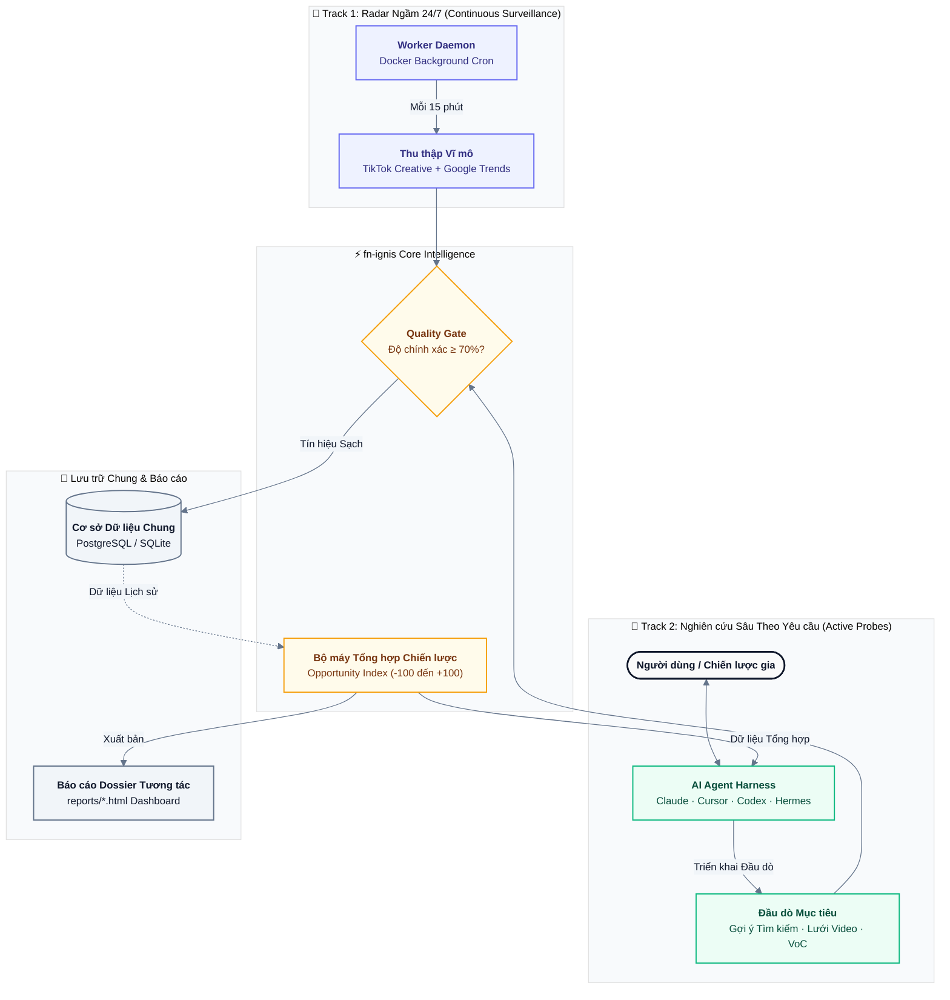

# fnIgnis 🔥 *(Mã dự án: fn-ignis)*

[](https://finolabs.io)
[](https://github.com/fioenix/fn-ignis/actions)
[](https://opensource.org/licenses/MIT)
[](https://www.python.org/downloads/)
[](https://modelcontextprotocol.io/)
[](https://www.docker.com/)

> **fnIgnis — Nền tảng Tự vận hành Lắng nghe Xu hướng & Khám phá Cơ hội Thị trường (Self-Hosted Market Intelligence Platform) phát triển bởi FINOLABS**
>
> 🌐 [English Version](README.md) · [Tài liệu Hướng dẫn Toàn diện](docs/USER_GUIDE.md)

`fnIgnis` (`fn-ignis`) là công cụ nghiên cứu chiến lược và lắng nghe thị trường hiệu năng cao, tự lưu trữ (self-hosted), được phát triển bởi **FINOLABS**. Nền tảng hỗ trợ các AI Agent (**Claude Desktop, Claude Code, Cursor, Windsurf, Antigravity, OpenAI Codex, OpenClaw, Nous Hermes**) và các nhà hoạch định chiến lược phát hiện các khoảng trống thị trường (white spaces) giá trị cao trên Google Trends, YouTube, TikTok Creative Center, gợi ý tìm kiếm TikTok và bình luận thực tế của khách hàng (Voice of Customer) với **chi phí token cào $0**, công thức tính toán toán học chuẩn xác (**Opportunity Index**), tự động nạp từ điển ngành linh hoạt và kết xuất báo cáo HTML Infographic trực quan, sắc nét.

---

## 🌟 Điểm Nổi bật & Ưu thế Cốt lõi

- **⚡ Chi phí Token Thu thập $0 (Zero-Token Local Ingress)**: Thu thập, lọc nhiễu và chuẩn hóa lượng lớn tín hiệu cục bộ bằng parser Python mà không tiêu tốn token LLM đắt đỏ cho công đoạn cào thô.
- **🏛️ Kiến trúc Song hành (Dual-Track Architecture)**: Kết hợp giữa daemon radar chạy ngầm 24/7 (`fn-ignis-worker`) và các chiến dịch nghiên cứu chuyên sâu theo yêu cầu (on-demand).
- **📊 Chỉ số Cơ hội Toán học (Opportunity Index)**: Định lượng khoảng trống thị trường (+100 đến -100) bằng cách so sánh tốc độ tăng trưởng nhu cầu tìm kiếm (Google/TikTok) với mức độ bão hòa nguồn cung nội dung (YouTube/TikTok).
- **🗣️ Lắng nghe Khách hàng Thực tế (Voice of Customer)**: Tự động trích xuất và tổng hợp các phản đối mua hàng, câu hỏi về giá và nhu cầu chưa được đáp ứng từ phần bình luận video công khai.
- **🧠 Từ điển Chuyên ngành Động (Autonomous Dynamic Lexicon Engine)**: Cho phép agent tự động đăng ký thuật ngữ/slang mới của từng ngành hàng vào cơ sở dữ liệu mà không cần sửa code.
- **🤖 Tương thích Toàn diện Hệ sinh thái Agent**: Hỗ trợ sẵn sàng out-of-the-box cho Claude, Cursor, Windsurf, Antigravity, Codex, OpenClaw và Hermes.

---

## 🏛️ Kiến trúc: Mô hình Song hành (Dual-Track Model)

<p align="center">
  
</p>
<p align="center">
  <small><em>Sơ đồ: Kiến trúc Tình báo Xu hướng & Nghiên cứu Thị trường Mô hình Song hành (<a href="docs/assets/architecture.svg">Vector SVG</a> · <a href="docs/assets/architecture.html">Bản HTML Độc lập</a>)</em></small>
</p>

<details>
  <summary>📄 <b>Xem mã nguồn sơ đồ Mermaid</b></summary>


</details>

---

## 🧭 Quy trình Vận hành Chuẩn 6 Bước (SOP)

Mọi chiến dịch nghiên cứu thị trường đều tuân theo quy trình 6 bước chuẩn mực:

```
Bước 1: Xác định Mục tiêu Nghiên cứu & Giả thuyết Cốt lõi
   ↓ (Đăng ký thuật ngữ/slang chuyên ngành vào DB qua register_domain_lexicon)
Bước 2: Quét Vĩ mô & Mở rộng Từ khóa Thực tế (Creative Center & Gợi ý Autocomplete)
   ↓ (Vòng phản hồi: Bổ sung từ khóa slang người dùng thực tế trước khi cào sâu)
Bước 3: Thu thập Đa nền tảng & Quality Gate (Lọc spam/nhiễu, Confidence >= 70%)
   ↓
Bước 4: Bóc tách Đơn nguồn qua 4 Lăng kính (Nhu cầu, Nguồn cung, Ý định, Tiếng nói Khách hàng)
   ↓
Bước 5: Tổng hợp Đa nguồn & Ma trận Opportunity Index (Xác định Khoảng trống Thị trường)
   ↓
Bước 6: Kết luận Chiến lược, Rào cản Gia nhập & Kế hoạch Kiểm chứng MVP (Kế hoạch 3-7 ngày + HTML Dashboard)
```

---

## 🤖 Tương thích Đa Nền tảng AI Agent

`fn-ignis` được thiết kế để tích hợp liền mạch với mọi nền tảng AI agent hiện đại:

| AI Agent / IDE | Cấu hình & Tiêu chuẩn | Khả năng Hỗ trợ |
|---|---|---|
| **Claude Desktop** | [`bundle/claude_desktop_config.json`](bundle/claude_desktop_config.json) | 34 FastMCP Tools, Prompts, Resources, tự động nạp 6 bước SOP |
| **Claude Code** | [`CLAUDE.md`](CLAUDE.md), [`.agents/skills/fn-ignis-harness/SKILL.md`](.agents/skills/fn-ignis-harness/SKILL.md) | Chuẩn Agent Skills, xuất Artifact HTML trực quan |
| **Cursor IDE** | [`.cursor/rules/fn-ignis.mdc`](.cursor/rules/fn-ignis.mdc), [`.cursorrules`](.cursorrules) | Nhận diện ngữ cảnh nghiên cứu thị trường đa nền tảng |
| **Windsurf IDE** | [`.windsurfrules`](.windsurfrules) | Giao thức quy tắc nghiên cứu từng bước cho Cascade |
| **Antigravity / Gemini Code** | [`AGENTS.md`](AGENTS.md) + Agent Skills | Radar liên tục Dual-Track & nạp từ điển động |
| **OpenAI Codex** | [`.codex/instructions.md`](.codex/instructions.md), [`.codexrules`](.codexrules) | Duy trì ngữ cảnh phiên chat (`codex://threads/...`), Structured Tools |
| **OpenClaw** | [`openclaw.json`](openclaw.json), [`.openclaw/config.yaml`](.openclaw/config.yaml) | Chuẩn OpenClaw Plugin v1 với Lifecycle Hooks |
| **Nous Hermes** | [`.hermes/tools.json`](.hermes/tools.json), [`hermes_manifest.json`](hermes_manifest.json) | Định dạng Function-Calling JSON Schema tiêu chuẩn |

---

## 🛠️ Danh mục 34 FastMCP Tools, Prompts & Resources

### 1. Nghiên cứu Thị trường & Tổng hợp Chiến lược
- **`run_autonomous_research_mission(topic, keywords, geo, timeframe, min_signals)`**: Khởi tạo chiến dịch, thu thập dữ liệu đa nguồn, tính toán Opportunity Index và xuất báo cáo trong 1 bước.
- **`create_research_mission(title, keywords, geo, timeframe, hypothesis)`**: Tạo chiến dịch nghiên cứu mới kèm giả thuyết cần kiểm chứng.
- **`execute_mission_ingress(mission_id)`**: Thực thi cào dữ liệu chuyên sâu và chấm điểm Quality Scorecard.
- **`evaluate_mission_quality(mission_id)`**: Đánh giá lại chất lượng dữ liệu (Coverage, Precision, Freshness, Diversity).
- **`discover_market_opportunities(mission_id)`**: Phát hiện các khoảng trống thị trường tiềm năng cao.
- **`get_mission_analysis(mission_id)`**: Trích xuất toàn văn báo cáo phân tích chiến lược tổng hợp.
- **`generate_mission_artifact(mission_id)`**: Xuất bản file HTML Dashboard Infographic tương tác trực quan vào thư mục `reports/`.
- **`list_research_missions(limit)`**: Liệt kê các chiến dịch nghiên cứu đã thực hiện.
- **`get_current_session_mission(session_id)`**: Khôi phục chiến dịch gắn với phiên chat hiện tại.
- **`trigger_autonomous_discovery(geo)`**: Kích hoạt chu kỳ tự động quét xu hướng toàn quốc.
- **`get_latest_daily_discovery(geo)`**: Lấy bản tin tổng hợp cơ hội thị trường hàng ngày mới nhất.

### 2. Lắng nghe Xã hội & Tiếng nói Khách hàng (Voice of Customer)
- **`get_tiktok_creative_center_trends(geo, period, limit, industry)`**: Lấy xếp hạng xu hướng chính thức từ TikTok Creative Center có lọc theo ngành hàng.
- **`get_tiktok_search_suggestions(keywords, geo)`**: Lấy từ khóa gợi ý tìm kiếm (autocomplete) thực tế của người dùng.
- **`get_tiktok_video_comments(video_url, limit)`**: Cào bình luận công khai từ một video TikTok cụ thể.
- **`extract_customer_pain_points(keywords, geo, max_videos, inquiry_patterns)`**: Bóc tách phản đối mua hàng, câu hỏi về giá và nhu cầu chưa được đáp ứng từ bình luận.

### 3. Từ điển Động & Chẩn đoán Hạ tầng
- **`register_domain_lexicon(domain, terms, category)`**: Đăng ký từ khóa/slang chuyên ngành vào cơ sở dữ liệu.
- **`register_noise_blacklist(terms)`**: Đăng ký từ khóa rác/spam cần loại bỏ.
- **`list_domain_lexicons(domain)`**: Tra cứu từ điển chuyên ngành đang hoạt động.
- **`diagnose_system_health()`**: Kiểm tra telemetry và trạng thái toàn bộ thành phần hệ thống.
- **`get_system_logs(limit, level)`**: Tra cứu nhật ký sự kiện kiểm toán hệ thống.
- **`verify_connectors_health()`**: Chạy kiểm tra tự động trạng thái YouTube API, Google RSS, Playwright, DB pool và Proxy.
- **`authenticate_tiktok()`**, **`get_platform_auth_status()`**, **`clear_platform_auth()`**: Quản lý phiên đăng nhập trình duyệt có mã hóa AES-256.
- **`authenticate_threads(auth_code?, client_id?, client_secret?, redirect_uri?, browser_login?)`**: Kết nối Meta theo mô hình Dual-UX. Gọi mà không truyền `auth_code` (hoặc đặt `browser_login=true`) sẽ chạy luồng Tier 1 — bắt phiên trình duyệt 1 chạm bằng tài khoản cá nhân thông thường, không cần Meta Developer App. Khi truyền `auth_code`, hệ thống chạy luồng Tier 2 OAuth 2.0 Graph API (authorization code → short-lived token → long-lived user token 60 ngày), lưu trữ mã hóa AES.
- **`get_threads_auth_status()`**: Kiểm tra cả hai tier — trạng thái token, scopes, `key_version`, số ngày còn lại, có cần refresh hay không, kèm thông tin phiên trình duyệt đã bắt được.
- **`clear_threads_auth()`**: Thu hồi và xóa credentials OAuth cùng phiên trình duyệt của Threads khỏi bộ lưu trữ mã hóa.
- **`authenticate_instagram(auth_code?, client_id?, client_secret?, redirect_uri?, browser_login?)`**: Luồng kết nối Dual-UX tương tự cho Instagram, phục vụ ingress Reels.
- **`get_instagram_auth_status()`**: Kiểm tra credentials Instagram đang lưu trên cả hai tier.
- **`clear_instagram_auth()`**: Thu hồi và xóa credentials OAuth cùng phiên trình duyệt của Instagram.
- **`get_trending_topics(geo, timeframe, limit)`**, **`get_topic_detail(topic_id)`**, **`generate_trend_artifact(topic_id, geo)`**, **`trigger_ingress_refresh(geo)`**: Khám phá xu hướng thời gian thực.

### 4. FastMCP Native Resources & Prompts
- **Resources**: `fn-ignis://sop/market-research`, `fn-ignis://methodology/opportunity-index`
- **Prompts**: `market_research_pipeline`, `voice_of_customer_audit`

---

## 📊 Báo cáo Nghiên cứu Thực tế Mẫu

Xem trực tiếp các báo cáo tương tác trực quan được kết xuất bởi `fn-ignis` trong thư mục [`reports/`](reports/):

| Chiến dịch / Hồ sơ | Phạm vi & Trọng tâm | Điểm nổi bật & Khoảng trống Phát hiện | Báo cáo Trực tiếp |
|---|---|---|:---:|
| **`[VN-AI-AGENT-90D]`** | AI Agents & CSKH Tự Động tại Việt Nam | Nhu cầu lớn về bot chăm sóc khách hàng; khoảng trống lớn ở mảng tích hợp chuyên sâu cho doanh nghiệp so với nội dung hướng dẫn đại trà. | [Xem Dossier HTML](reports/case_study_ai_agents_vn.html) |
| **`[VN-LINEN-FASHION-30D]`** | Thời trang, Vải Linen & Local Brand | Nhu cầu tìm kiếm đồ linen công sở tối giản tăng vọt theo mùa; thiếu hụt nguồn cung sơ mi linen phom rộng cao cấp. | [Xem Dossier HTML](reports/case_study_linen_fashion_vn.html) |
| **`[VN-TIKTOK-SHOP-30D]`** | Công cụ TikTok Shop & Livestream Automation | Nhu cầu cao về chốt đơn tự động và đồng bộ kho livestream; mật độ câu hỏi về giá và chiết khấu rất dày đặc. | [Xem Dossier HTML](reports/case_study_tiktok_shop_automation_vn.html) |

---

## ⚡ Cài đặt & Bắt đầu Nhanh

### 🤖 1. Cài đặt Tự động 1-Lệnh cho AI Agent (Khuyến nghị)
Nếu bạn là AI Agent (**Claude Code, Cursor, Windsurf, Devin, Antigravity, OpenClaw, Hermes**) hoặc muốn cài đặt tự động 1 lệnh trên máy:
```bash
git clone https://github.com/fioenix/fn-ignis.git && cd fn-ignis
./scripts/bootstrap.sh
```
*Script sẽ tự động khởi tạo môi trường Python virtualenv, SQLite database, sinh file `.env` với khóa bảo mật Fernet AES-256, tự động đăng ký MCP vào Claude Desktop, Cursor, VS Code và chạy kiểm tra hệ thống.*

---

### 2. Cài đặt Thủ công Cục bộ Zero-Docker (SQLite)
Chạy `fn-ignis` trên máy cá nhân **không cần cài đặt Docker hay PostgreSQL**:
```bash
# 1. Clone repo & khởi tạo virtual environment
git clone https://github.com/fioenix/fn-ignis.git && cd fn-ignis
uv venv && source .venv/bin/activate && uv pip install -e .

# 2. Khởi chạy FastMCP Server trực tiếp (SQLite tự động khởi tạo)
ignis-mcp
```

### 3. Triển khai Trọn gói Production (Docker Compose)
Triển khai toàn bộ cụm doanh nghiệp (TimescaleDB + Worker Daemon Chạy ngầm + Nginx Web Portal xem báo cáo):
```bash
# Khởi chạy full stack
docker compose -f docker-compose.prod.yml up -d
```

---

## 📖 Cẩm nang Hướng dẫn Chi tiết (User Guide)

Để xem hướng dẫn cài đặt từng bước, code mẫu tích hợp Python scripting, vận hành Docker và xử lý sự cố thường gặp, vui lòng tham khảo **[Cẩm nang Hướng dẫn Sử dụng Thủ công (docs/USER_GUIDE.md)](docs/USER_GUIDE.md)**.

---

## ⚙️ Biến Môi trường (.env)

| Tên biến | Mô tả | Mặc định | Bắt buộc |
|---|---|---|:---:|
| `DATABASE_URL` | Chuỗi kết nối SQLite (`sqlite:///ignis.db`) hoặc PostgreSQL/TimescaleDB | `sqlite:///ignis.db` | **Có** |
| `YOUTUBE_API_KEY` | Google Cloud YouTube Data API v3 Key | `""` | Tùy chọn |
| `DEFAULT_GEO` | Mã quốc gia ISO mặc định cho nghiên cứu xu hướng | `VN` | Không |
| `SCHEDULER_INTERVAL_SECONDS` | Tần suất heartbeat của daemon scheduler (giây) | `900` (15 phút) | Không |
| `DISCOVERY_INTERVAL_HOURS` | Khoảng cách giữa các đợt tự động quét toàn diện (giờ) | `24` (hàng ngày) | Không |
| `SYNC_INTERVAL_MINUTES` | Tùy chọn ghi đè chu kỳ đồng bộ ingress (phút; 0 = dùng SCHEDULER_INTERVAL_SECONDS) | `0` | Không |
| `YOUTUBE_CACHE_TTL_SECONDS` | Thời gian cache kết quả tìm kiếm YouTube để bảo vệ quota API | `86400` (24h) | Không |
| `PLAYWRIGHT_PROXY_SERVER` | Proxy HTTP/SOCKS tùy chọn khi cào dữ liệu qua Playwright | `""` | Không |
| `IGNIS_ENCRYPTION_KEY` | Khóa Fernet AES-256 mã hóa cookie phiên đăng nhập | *(Tự sinh)* | Không |

---

## 🧪 Kiểm thử & Xác thực

Chạy bộ test suite với 100% async coverage (91 kiểm thử tự động):
```bash
uv run pytest
```

---

## 🛡️ Bảo mật & Quyền riêng tư

- **Không rò rỉ dữ liệu (Zero Data Leakage)**: Toàn bộ dữ liệu cào thô được phân tích và bóc tách cục bộ. Không gửi dữ liệu thô ra các mô hình LLM bên thứ ba trừ khi agent được chỉ định rõ ràng.
- **Mã hóa AES-256**: Trạng thái phiên trình duyệt và thông tin xác thực được mã hóa an toàn bằng AES-256 / Fernet.
- **Truy vấn SQL tham số hóa**: Tất cả truy vấn cơ sở dữ liệu sử dụng parameterized query để chống tấn công SQL Injection.
- Báo cáo lỗ hổng bảo mật: Xem chi tiết tại [Chính sách Bảo mật (SECURITY.md)](SECURITY.md).

---

## 🤝 Đóng góp & Phát triển Cộng đồng

Chúng tôi luôn hoan nghênh sự đóng góp từ cộng đồng mã nguồn mở! Vui lòng tham khảo [Quy định Đóng góp (CONTRIBUTING.md)](CONTRIBUTING.md) và [Bộ Quy tắc Ứng xử (CODE_OF_CONDUCT.md)](CODE_OF_CONDUCT.md) trước khi tạo pull request.

---

## 📄 Giấy phép Bản quyền (License)

Dự án được phân phối dưới giấy phép **MIT License**. Xem chi tiết tại tệp [`LICENSE`](LICENSE).
